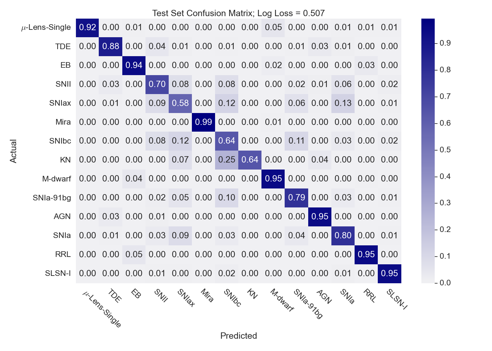
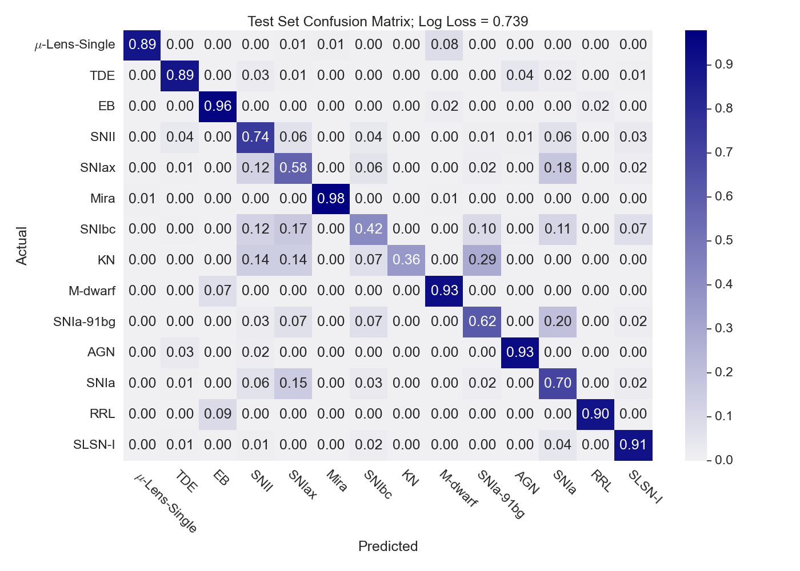

# `astronet`

                                                      .  '  *   .  . '
                                                          .  * * -+-
                                                      .    * .    '  *
                                                          * .  ' .  .
                                                       *   *  .   .
                                                         '   *
                  _____                         _____
    ______ _________  /___________________________  /_
    _  __ `/_  ___/  __/_  ___/  __ \_  __ \  _ \  __/
    / /_/ /_(__  )/ /_ _  /   / /_/ /  / / /  __/ /_
    \__,_/ /____/ \__/ /_/    \____//_/ /_/\___/\__/


[](https://github.com/tallamjr/astronet/actions/workflows/pytest.yml)
[](https://codecov.io/gh/tallamjr/astronet)

`astronet` is a package to classify Astrophysical transients using Deep Learning methods

### `astronet.t2`



### `astronet.atx`



### MTS Benchmark Results

|                       |       t2 |     atx | MLP        | FCN        | ResNet     | Encoder    | MCNN      | t-LeNet    | MCDCNN     | Time-CNN   | TWIESN     |
|:----------------------|---------:|--------:|:-----------|:-----------|:-----------|:-----------|:----------|:-----------|:-----------|:-----------|:-----------|
| ArabicDigits          |  97.3182 | 98.3636 | 96.9(0.2)  | 99.4(0.1)  | 99.6(0.1)  | 98.1(0.1)  | 10.0(0.0) | 10.0(0.0)  | 95.9(0.2)  | 95.8(0.3)  | 85.3(1.4)  |
| AUSLAN                |  92.9123 | 83.8596 | 93.3(0.5)  | 97.5(0.4)  | 97.4(0.3)  | 93.8(0.5)  | 1.1(0.0)  | 1.1(0.0)   | 85.4(2.7)  | 72.6(3.5)  | 72.4(1.6)  |
| CharacterTrajectories |  94.5661 | 96.4425 | 96.9(0.2)  | 99.0(0.1)  | 99.0(0.2)  | 97.1(0.2)  | 5.4(0.8)  | 6.7(0.0)   | 93.8(1.7)  | 96.0(0.8)  | 92.0(1.3)  |
| CMUsubject16          | 100      | 72.4138 | 60.0(16.9) | 100.0(0.0) | 99.7(1.1)  | 98.3(2.4)  | 53.1(4.4) | 51.0(5.3)  | 51.4(5.0)  | 97.6(1.7)  | 89.3(6.8)  |
| ECG                   |  84      | 33      | 74.8(16.2) | 87.2(1.2)  | 86.7(1.3)  | 87.2(0.8)  | 67.0(0.0) | 67.0(0.0)  | 50.0(17.9) | 84.1(1.7)  | 73.7(2.3)  |
| JapaneseVowels        |  97.2973 | 94.8649 | 97.6(0.2)  | 99.3(0.2)  | 99.2(0.3)  | 97.6(0.6)  | 9.2(2.5)  | 23.8(0.0)  | 94.4(1.4)  | 95.6(1.0)  | 96.5(0.7)  |
| KickvsPunch           |  90      | 40      | 61.0(12.9) | 54.0(13.5) | 51.0(8.8)  | 61.0(9.9)  | 54.0(9.7) | 50.0(10.5) | 56.0(8.4)  | 62.0(6.3)  | 67.0(14.2) |
| Libras                |  81.6667 | 74.4444 | 78.0(1.0)  | 96.4(0.7)  | 95.4(1.1)  | 78.3(0.9)  | 6.7(0.0)  | 6.7(0.0)   | 65.1(3.9)  | 63.7(3.3)  | 79.4(1.3)  |
| NetFlow               |  77.9026 | 77.9026 | 55.0(26.1) | 89.1(0.4)  | 62.7(23.4) | 77.7(0.5)  | 77.9(0.0) | 72.3(17.6) | 63.0(18.2) | 89.0(0.9)  | 94.5(0.4)  |
| UWave                 |  84.5255 | 90.9537 | 90.1(0.3)  | 93.4(0.3)  | 92.6(0.4)  | 90.8(0.4)  | 12.5(0.0) | 12.5(0.0)  | 84.5(1.6)  | 85.9(0.7)  | 75.4(6.3)  |
| Wafer                 |  89.3973 | 89.3973 | 89.4(0.0)  | 98.2(0.5)  | 98.9(0.4)  | 98.6(0.2)  | 89.4(0.0) | 89.4(0.0)  | 65.8(38.1) | 94.8(2.1)  | 94.9(0.6)  |
| WalkvsRun             | 100      | 25      | 70.0(15.8) | 100.0(0.0) | 100.0(0.0) | 100.0(0.0) | 75.0(0.0) | 60.0(24.2) | 45.0(25.8) | 100.0(0.0) | 94.4(9.1)  |

#### Tests

Note: some tests require large data files

If a new plot is create, it should be checked and a new baseline generate like so:

```bash
$ cd astronet/tests/unit/viz
$ pytest --mpl-generate-path=baseline --ignore-glob="*.ipynb" test_plots.py
```
Then the hash of the image to be stored in the SHA library file

```bash
$ pytest --mpl-generate-hash-library=astronet/tests/unit/viz/baseline/hashlib.json --ignore-glob="*.ipynb" test_plots.py
```
Finally, the suite is ready to be tests with:
```bash
$ pytest --ignore-glob="*.ipynb" test_plots.py
```
