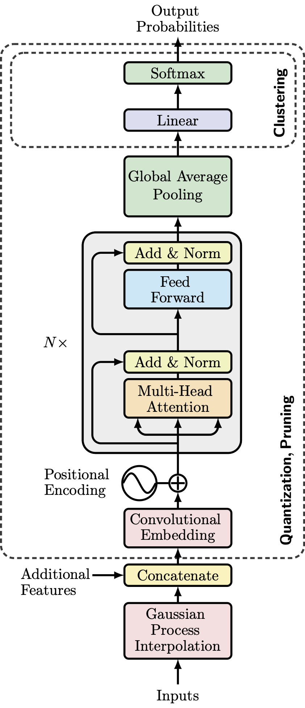
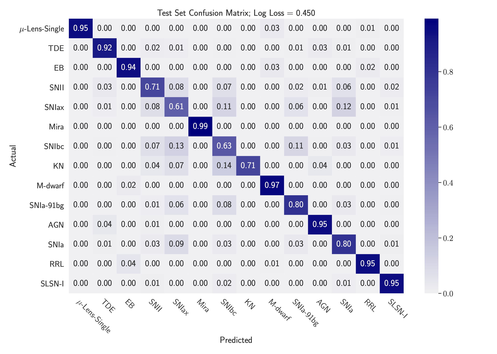
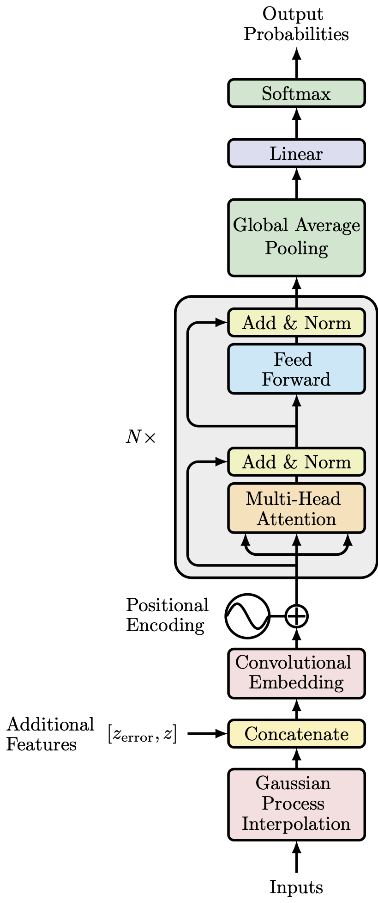
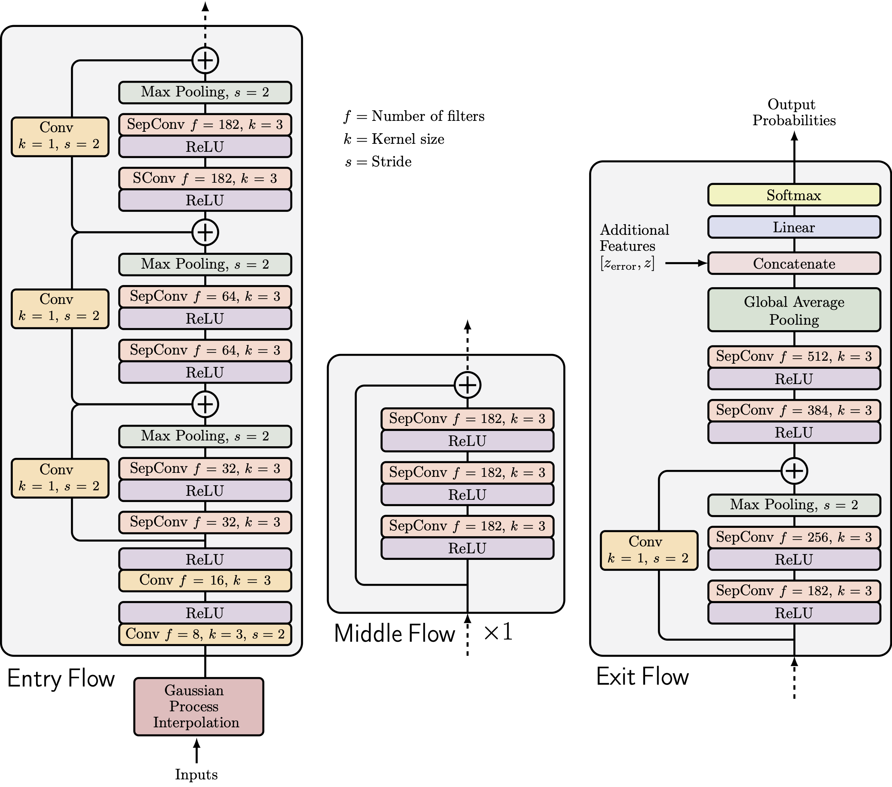

# `astronet`

                                                      .  '  *   .  . '
                                                          .  * * -+-
                                                      .    * .    '  *
                                                          * .  ' .  .
                                                       *   *  .   .
                                                         '   *
                  _____                         _____
    ______ _________  /___________________________  /_
    _  __ `/_  ___/  __/_  ___/  __ \_  __ \  _ \  __/
    / /_/ /_(__  )/ /_ _  /   / /_/ /  / / /  __/ /_
    \__,_/ /____/ \__/ /_/    \____//_/ /_/\___/\__/


[](https://github.com/tallamjr/astronet/actions/workflows/pytest.yml)
<!-- [](https://codecov.io/gh/tallamjr/astronet) -->

`astronet` is a package to classify Astrophysical transients using Deep Learning methods
___________________________

### Citation

If you find the software here useful, please consider citing this work.

```latex
@software{Allam_Jr_astronet_Multivariate_Time-Series_2022,
  author = {Allam Jr., Tarek},
  month = {6},
  title = {{astronet: Multivariate Time-Series Classification of Astrophysical Transients using Deep Learning}},
  url = {https://github.com/tallamjr/astronet},
  year = {2022}
}

```

🚧 **WARNING** 🚧

Expect this to be "unstable" with frequent changes to the API. See below for details on [The Road to `v1.0.0`](#roadmap)

___________________________

### `astronet.tinho`

<p>
  
</p>

<!--  -->



### `astronet.t2` [https://arxiv.org/abs/2105.06178]

<p>
  
</p>

<!--  -->


### `astronet.atx`

<p>
  
</p>

<!--  -->


___________________________

### MTS Benchmark Results

Results can be found in `./results`. Where results are `-9999`, the run was unstable and needs to be
trained again.

#### Accuracy

|                       |     t2 |   atx |    cnn |   encoder |    fcn |   mcdcnn |   mcnn |   mlp |   resnet |   tlenet |   twiesn |
|:----------------------|-------:|------:|-------:|----------:|-------:|---------:|-------:|------:|---------:|---------:|---------:|
| ArabicDigits          |  97.32 | 98.50 |  95.77 |     98.07 |  99.42 |    95.88 |  10.00 | 96.91 |    99.55 |    10.00 |    85.28 |
| AUSLAN                |  92.91 | 87.09 |  72.55 |     93.84 |  97.54 |    85.38 |   1.05 | 93.26 |    97.40 |     1.05 |    72.41 |
| CharacterTrajectories |  94.57 | 97.97 |  96.00 |     97.06 |  98.98 |    93.82 |   5.36 | 96.90 |    99.04 |     6.68 |    92.04 |
| CMUsubject16          | 100.00 | 93.10 |  97.59 |     98.28 | 100.00 |    51.38 |  53.10 | 60.00 |    99.66 |    51.03 |    89.31 |
| ECG                   |  84.00 | 76.00 |  84.10 |     87.20 |  87.20 |    50.00 |  67.00 | 74.80 |    86.70 |    67.00 |    73.70 |
| JapaneseVowels        |  97.30 | 97.03 |  95.65 |     97.57 |  99.30 |    94.43 |   9.24 | 97.57 |    99.16 |    23.78 |    96.54 |
| KickvsPunch           |  90.00 | 70.00 |  62.00 |     61.00 |  54.00 |    56.00 |  54.00 | 61.00 |    51.00 |    50.00 |    67.00 |
| Libras                |  82.78 | 74.44 |  63.72 |     78.33 |  96.39 |    65.06 |   6.67 | 78.00 |    95.44 |     6.67 |    79.44 |
| NetFlow               |  86.14 | 77.90 |  88.95 |     77.70 |  89.06 |    62.96 |  77.90 | 55.04 |    62.72 |    72.32 |    94.49 |
| UWave                 |  84.53 | 90.95 |  85.88 |     90.76 |  93.43 |    84.50 |  12.50 | 90.06 |    92.59 |    12.51 |    75.44 |
| Wafer                 |  89.40 | 89.40 |  94.81 |     98.56 |  98.24 |    65.76 |  89.40 | 89.40 |    98.85 |    89.40 |    94.90 |
| WalkvsRun             | 100.00 | 75.00 | 100.00 |    100.00 | 100.00 |    45.00 |  75.00 | 70.00 |   100.00 |    60.00 |    94.38 |

#### Precision

|                       |         t2 |        atx |    cnn |   encoder |    fcn |   mcdcnn |   mcnn |   mlp |   resnet |   tlenet |   twiesn |
|:----------------------|-----------:|-----------:|-------:|----------:|-------:|---------:|-------:|------:|---------:|---------:|---------:|
| ArabicDigits          |      96.79 |      98.51 |  95.84 |     98.10 |  99.43 |    95.95 |   1.00 | 96.97 |    99.56 |     1.00 |    86.16 |
| AUSLAN                |      86.19 |      88.46 |  76.12 |     94.72 |  97.92 |    87.87 |   0.01 | 94.41 |    97.79 |     0.01 |    75.00 |
| CharacterTrajectories |      87.14 |      97.84 |  96.18 |     97.11 |  98.86 |    93.86 |   0.27 | 96.98 |    98.91 |     0.33 |    92.94 |
| CMUsubject16          |      27.59 |      93.03 |  97.50 |     98.23 | 100.00 |    30.60 |  26.55 | 39.46 |    99.71 |    25.52 |    89.59 |
| ECG                   |      77.39 |      41.33 |  81.87 |     85.55 |  85.31 |    25.00 |  33.50 | 65.05 |    84.91 |    33.50 |    70.96 |
| JapaneseVowels        |      96.09 |      96.84 |  95.56 |     97.33 |  99.14 |    94.22 |   1.03 | 97.33 |    99.00 |     2.64 |    96.75 |
| KickvsPunch           |      79.17 |      69.05 |  68.19 |     62.39 |  52.12 |    28.00 |  27.00 | 58.21 |    55.19 |    25.00 |    67.98 |
| Libras                |      84.32 |      74.77 |  64.15 |     79.12 |  96.69 |    67.17 |   0.44 | 79.66 |    95.84 |     0.44 |    81.62 |
| NetFlow               |      80.58 |      38.95 |  84.61 |     42.78 |  85.77 |    45.80 |  38.95 | 34.93 |    69.33 |    36.16 |    94.19 |
| UWave                 | -999900.00 |      90.46 |  86.19 |     90.99 |  93.42 |    85.05 |   1.56 | 90.70 |    92.59 |     1.56 |    77.38 |
| Wafer                 | -999900.00 | -999900.00 |  87.89 |     98.27 |  96.09 |    32.88 |  44.70 | 44.70 |    97.95 |    44.70 |    97.20 |
| WalkvsRun             |      37.50 |      37.50 | 100.00 |    100.00 | 100.00 |    22.50 |  37.50 | 35.00 |   100.00 |    30.00 |    93.05 |

#### Recall

|                       |         t2 |        atx |    cnn |   encoder |    fcn |   mcdcnn |   mcnn |   mlp |   resnet |   tlenet |   twiesn |
|:----------------------|-----------:|-----------:|-------:|----------:|-------:|---------:|-------:|------:|---------:|---------:|---------:|
| ArabicDigits          |      96.77 |      98.50 |  95.77 |     98.07 |  99.42 |    95.88 |  10.00 | 96.91 |    99.55 |    10.00 |    85.28 |
| AUSLAN                |      84.63 |      87.09 |  72.55 |     93.84 |  97.54 |    85.38 |   1.05 | 93.26 |    97.40 |     1.05 |    72.41 |
| CharacterTrajectories |      86.63 |      97.69 |  95.66 |     96.77 |  98.86 |    93.48 |   5.00 | 96.62 |    98.91 |     5.00 |    91.44 |
| CMUsubject16          |      50.00 |      93.03 |  97.81 |     98.37 | 100.00 |    50.31 |  50.00 | 58.13 |    99.62 |    50.00 |    89.23 |
| ECG                   |      77.39 |      49.23 |  83.14 |     85.60 |  86.53 |    50.00 |  50.00 | 72.27 |    85.15 |    50.00 |    66.53 |
| JapaneseVowels        |      95.70 |      96.96 |  96.21 |     97.89 |  99.28 |    94.26 |  11.11 | 97.71 |    99.23 |    11.11 |    97.21 |
| KickvsPunch           |      79.17 |      66.67 |  65.83 |     62.50 |  55.00 |    50.00 |  50.00 | 61.25 |    55.00 |    50.00 |    68.33 |
| Libras                |      82.78 |      73.33 |  63.72 |     78.33 |  96.39 |    65.06 |   6.67 | 78.00 |    95.44 |     6.67 |    79.44 |
| NetFlow               |      77.45 |      50.00 |  82.59 |     50.41 |  81.05 |    50.21 |  50.00 | 50.77 |    66.20 |    50.00 |    89.49 |
| UWave                 | -999900.00 |      90.25 |  85.88 |     90.76 |  93.43 |    84.50 |  12.50 | 90.06 |    92.59 |    12.50 |    75.44 |
| Wafer                 | -999900.00 | -999900.00 |  83.41 |     94.05 |  94.56 |    50.00 |  50.00 | 50.00 |    95.97 |    50.00 |    75.99 |
| WalkvsRun             |      50.00 |      50.00 | 100.00 |    100.00 | 100.00 |    50.00 |  50.00 | 50.00 |   100.00 |    50.00 |    95.42 |

___________________________

## Tests

See `astronet/tests/README.md` for more details

Note: some tests require large data files

If a new plot is created, it should be visually inspected and a new baseline generated.

Run from top-level directory (where this `README.md` file is):

```bash
$ unset CI; pytest --mpl-generate-path=astronet/tests/reg/baseline --mpl-hash-library=baseline/arm64-hashlib.json --mpl-results-always astronet/tests/reg/test_plots.py
```

___________________________

## The Road to `v1.0.0`
<a id="roadmap"></a>

The idea of `astronet` is not really to be a library, more of a repository for the code developed
during my PhD and my thesis.

Having said that, it would be nice to have `astronet` be more "stable" and to have extra features
that would allow someone else to pick it up and use with _minimal_ frustrations.

Therefore, the plan is to get to `v1.0.0` at some point, but I will not be prioritizing this. Anyone
interested should follow this meta-issue where I will log the progress and put placeholder issues
to-be-tackle in order for `v1.0.0` to be "ready".

The main aspects will be a reduce cost data processing pipeline that can work lazily on the PLAsTiCC
dataset, ideally being able to go from the source online to useable `astronet` format. Once this is
done, much of the rest of the updates will be cosmetic and to ensure usability of the codebase.

